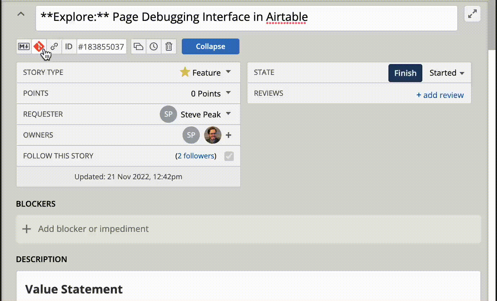

Pivotal Markdown Link (Cole's Style)
======

### 📖 Demo



PMDL is a Browser [Content Script Extension](https://developer.mozilla.org/en-US/docs/Mozilla/Add-ons/WebExtensions/manifest.json/content_scripts) that places a few extra buttons into a [Pivotal Tracker](pivotaltracker.com) story card.

### 🚀 Usage

The extension can be cloned and loaded unpacked into your extensions without any build steps.

### 🔎 Example


Clicking the button will copy a markdown link to the story to your clipboard and ready to paste into Github PR or wherever

Produces markdown links in the following format

```md
[PT{{ID}}: "{{NAME}}"]({{URL}})
```

For instance

```md
[PT1337: "The best story in the world"](https://www.pivotaltracker.com/story/show/1337)
```
